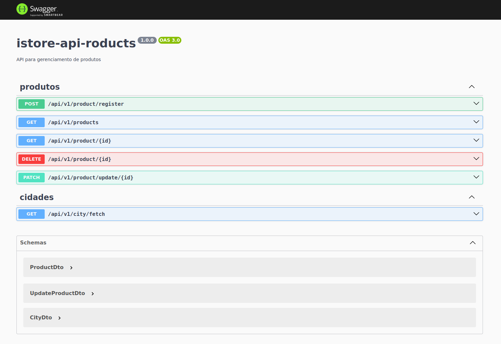

<h1 align="center">iStore</h1>

<p align="center">Backend para um sistema de gerenciamento de loja</p>

<p align="center">Status: em desenvolvimento</p>

<p align="center">
  <a href="#Projeto">Projeto</a>&nbsp;&nbsp;&nbsp;|&nbsp;&nbsp;&nbsp;
  <a href="#Recursos">Recursos</a>&nbsp;&nbsp;&nbsp;|&nbsp;&nbsp;&nbsp;
  <a href="#Tecnologias">Tecnologias</a>&nbsp;&nbsp;&nbsp;|&nbsp;&nbsp;&nbsp;
  <a href="#Funcionalidades">Funcionalidades</a>&nbsp;&nbsp;&nbsp;|&nbsp;&nbsp;&nbsp;
  <a href="#Como utilizar">Como utilizar</a>&nbsp;&nbsp;&nbsp;|&nbsp;&nbsp;&nbsp;
  <a href="#Desenvolvimento">Desenvolvimento</a>&nbsp;&nbsp;&nbsp;|&nbsp;&nbsp;&nbsp;
  <a href="#Autor">Autor</a>&nbsp;&nbsp;&nbsp;|&nbsp;&nbsp;&nbsp;
</p>

<br>

<p align="center">
  
</p>

# Projeto

O objetivo desse projeto é prover uma API para gerenciamento de produtos.

## Recursos

> Cadastro de produtos

- Realiza cadastro de produtos de acordo com dados pré estabelecidos;

> Listagem de produtos

- Possui endpoint para listar todos os produtos;
- Possui suporte a paginação a otimizar o retorno de informações.
- Possui possibilidade de filtrar produtos por nome e categoria através dos parâmetros `name` e `category`

> Listar produto por ID

- Possui endpoint para listar produto por ID;

> Atualização de produtos

- Possui endpoint para atualizar produto;
- Realiza atualização das informações do produto de acordo com dados pré estabelecidos;

> Remoção de produtos

- Possui endpoint para atualizar produto;
- Realiza atualização das informações do produto de acordo com dados pré estabelecidos;

> Extração cidades

- Realiza busca na API do [IBGE](https://servicodados.ibge.gov.br/api/v1/localidades/estados/33/municipios) por todas as cidades do estado do Rio de Janeiro.
- Gera massa de dados para persistência de acordo com parâmetro pré estabelecido

> Salva os dados de cidades

- Salva apenas cidades ainda não cadastradas
- Caso a cidade já esteja cadastrada, o sistema exibe informação ao usuário

> Testes

- Possui testes unitários e de integração para serviços e controladores utilizando a biblioteca Jest.

# Tecnologias

- Node.js
- Nest.js
- TypeScript
- PostgreSQL
- Docker
- Jest

# Funcionalidades

> Transformação de dados

- Utilização de `mappers` e `DTOs` para adequar transformação de dados

> Tratamento de erros

- Lida com erros de forma apropriada, evitando encerramento inesperado e mau funcionamento da aplicação

> Documentação

- Utiliza a biblioteca `@nestjs/swagger` para criar uma documentação concisa e auto explicativa;
- Utiliza a prática de `Conventional Commits` que busca padronizar mensagens de commits no repositório;
- Utiliza a prática de `Small Commits` que busca detalhar as atividades desenvolvidas e permitir maior controle sobre as alterações realizadas.

> Organização do projeto

- Organiza arquivos do projeto por módulos, que contém suas respectivas funcionalidades;
- Organiza recursos compartilhados em diretórios separados, buscando facilitar a identificação dos recursos.

> Arquitetura do projeto

- Utiliza os princípios arquiteturais oferecidos pelo Nest.js, fazendo uso apropriado de `Decorators`, `Dependency injection`, `Repositories`, juntamente com princípios de SOLID.

> Estrutura de arquivos do projeto

```
src/
├── app.module.ts
├── main.ts
└── modules
    ├── product
    │   ├── controllerssrc/
├── app.module.ts
├── main.ts
└── modules
    ├── city
    │   ├── city.module.ts
    │   ├── controllers
    │   │   ├── fetch-city.controller.ts
    │   │   └── index.ts
    │   ├── dtos
    │   │   ├── city.dto.ts
    │   │   └── index.ts
    │   ├── entities
    │   │   ├── city.entity.ts
    │   │   └── index.ts
    │   ├── helpers
    │   │   ├── index.ts
    │   │   └── mapper-city.ts
    │   ├── interfaces
    │   │   ├── city.usecases.ts
    │   │   └── index.ts
    │   ├── __mocks__
    │   │   ├── city.mock.ts
    │   │   └── index.ts
    │   ├── services
    │   │   ├── fetch-city.service.ts
    │   │   ├── index.ts
    │   │   └── save-city.service.ts
    │   └── __tests__
    │       ├── fetch-city.controller.spec.ts
    │       ├── fetch-city.service.spec.ts
    │       └── save-city.service.spec.ts
    ├── product
    │   ├── controllers
    │   │   ├── create-product.controller.ts
    │   │   ├── delete-product.controller.ts
    │   │   ├── index.ts
    │   │   ├── read-product-by-id.controller.ts
    │   │   ├── read-products.controller.ts
    │   │   └── update-product.controller.ts
    │   ├── dtos
    │   │   ├── create-product.dto.ts
    │   │   ├── index.ts
    │   │   ├── product-filter.dto.ts
    │   │   └── update-product.dto.ts
    │   ├── entities
    │   │   ├── index.ts
    │   │   └── product.entity.ts
    │   ├── interfaces
    │   │   ├── index.ts
    │   │   └── product.usecases.ts
    │   ├── __mocks__
    │   │   ├── index.ts
    │   │   └── product.mocks.ts
    │   ├── product.module.ts
    │   ├── services
    │   │   ├── create-product.service.ts
    │   │   ├── delete-product.service.ts
    │   │   ├── index.ts
    │   │   ├── read-product-by-id.service.ts
    │   │   ├── read-products.service.ts
    │   │   └── update-product.service.ts
    │   └── __tests__
    │       ├── create-product-controller.e2e.spec.ts
    │       ├── create-product.controller.spec.ts
    │       ├── create-product.service.spec.ts
    │       ├── delete-product.controller.spec.ts
    │       ├── delete-product.service.spec.ts
    │       ├── read-product-by-id.controller.spec.ts
    │       ├── read-product-by-id.service.spec.ts
    │       ├── read-products.controller.spec.ts
    │       ├── read-products.service.spec.ts
    │       ├── update-product-controller.spec.ts
    │       └── update-product.service.spec.ts
    └── shared
        ├── dtos
        │   ├── index.ts
        │   ├── page.dto.ts
        │   ├── page-meta.dto.ts
        │   └── page-options.dto.ts
        ├── enums
        │   ├── index.ts
        │   ├── page-order.enum.ts
        │   └── register-status.enum.ts
        ├── exceptions
        │   ├── conflit-content.exception.ts
        │   ├── data-not-found.exeption.ts
        │   ├── http-exception.filter.ts
        │   └── index.ts
        ├── helpers
        │   ├── fetch-api.helper.ts
        │   ├── http-response.ts
        │   ├── index.ts
        │   ├── mapper-dto-to-entity-arrays.ts
        │   └── mapper-dto-to-entity.ts
        └── interfaces
            ├── index.ts
            └── page-meta-params.ts
```


# Como utilizar

**1. Requisitos**

Certifique-se de possuir os itens abaixo instalados:

- [Node.js](https://nodejs.org/en/download)
- [NPM](https://docs.npmjs.com/)
- [Docker](https://www.docker.com/)
- [Git](https://git-scm.com)

**2. Clone este repositório**

```
git clone git@github.com:vieira-a/istore-api.git
```

**3. Configure variáveis de ambiente**

- Crie um arquivo `.env` na raiz do projeto de acordo com o arquivo `.env.example`:

```
DB_HOST=
DB_PORT=
DB_NAME=
DB_USERNAME=
DB_PASSWORD=
DB_ADMIN_EMAIL=
```
Esses dados serão utilizados para criar o container do banco de dados **PostgreSQL** e da interface de gerenciamento do banco de dados, o **pgAdmin**.

Além disso, será criada uma instância de banco de dados com o nome de acordo com a variável de ambiente `DB_NAME`

**4. Crie e execute os containers necessários**

`docker-compose up -d`

**5. Instale as dependências do projeto**

`npm install`

**6. Realize a migração dos modelos de dados**

`npm run migration:generate -- db/migrations/create-database-tables`

Este comando criará um arquivo com as configurações das migrações que serão realizadas no diretório `db/migrations`

**7. Execute as migrações**

`npm run migration:run`

**8. Execute o script para popular a tabela de produtos**

`npm run seed:run `

**9. Inicialize a aplicação**

`npm run start:dev`

**10. Acesso**

- API: http://localhost:3000/api/v1
- Documentação: http://localhost:3000/api/v1/doc

# Desenvolvimento

Para visualizar todas as tarefas que foram executadas durante o desenvolvimento deste projeto, veja o arquivo `TODO.md`

# Autor

[Anderson Vieira](https://www.linkedin.com/in/vieira-a)